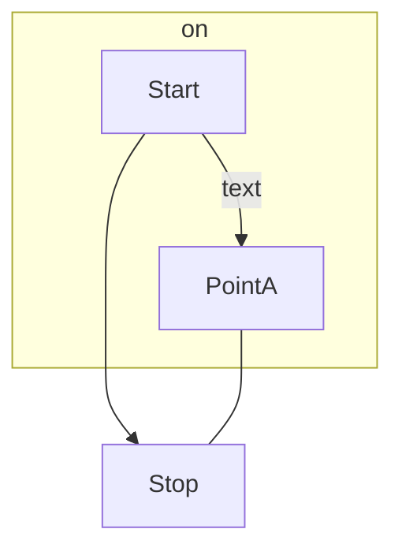
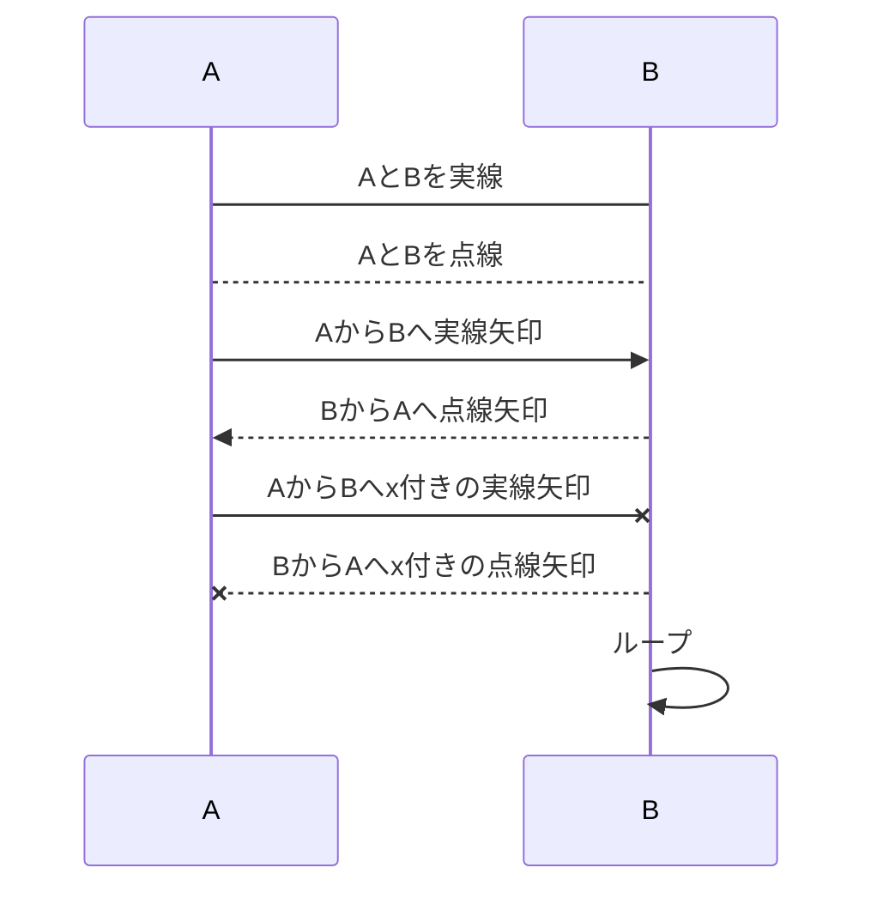
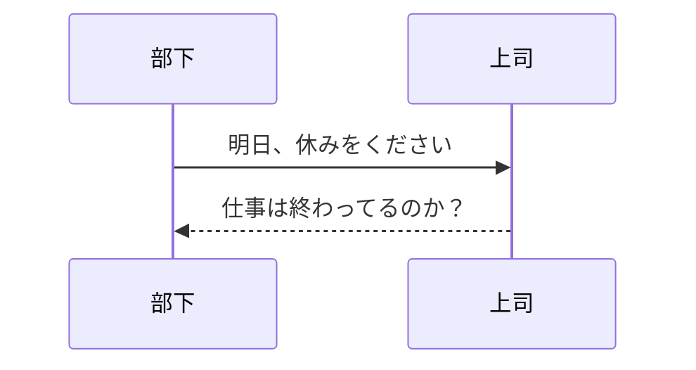
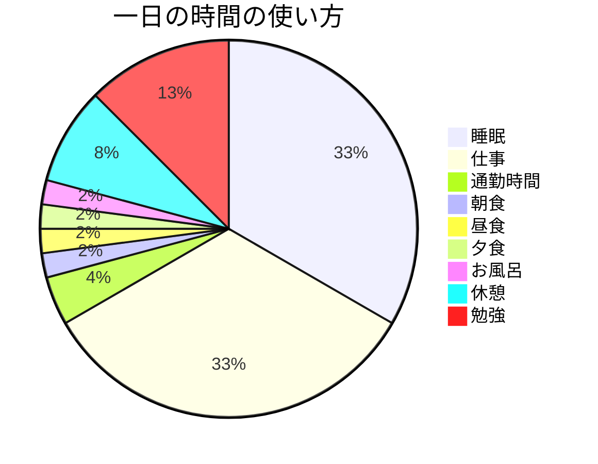

## マーメイド記法の練習

```python
print('Hello World')
```

```
graph TD;
    A-->B;
    A-->C;
    B-->D;
    C-->D;
```

## フローチャートの記述
このコードは上から下へ記述するフローチャートで、この拡張機能でプレビューすると以下のようになります
```
flowchart TD
    Start --> Stop
    subgraph on
    Start --> |text|PointA
    end
    PointA --- Stop
``` 

## 入力方法と結果
各シーケンス図の結び方①
|入力方法|入力結果
| -- | -- |
|A -> B|AとBを実線でつなぐ|
|A --> B|AとBを点線でつなぐ|
|A ->> B|AとBを方向つきの実線でつなぐ|
|A -->> B|AとBを方向つきの点線でつなぐ|
|A -x B|AとBをx付きの実線でつなぐ|
|A --x B|AとBをx付きの点線でつなぐ|

各シーケンス図の結び方②
```
sequenceDiagram
    A->B:AとBを実線
    A-->B:AとBを点線 
    A->>B:AからBへ実線矢印
    B-->>A:BからAへ点線矢印
    A -x B:AからBへx付きの実線矢印
    B --x A:BからAへx付きの点線矢印
    B->>B:ループ
```

## シーケンス図の記述
```
sequenceDiagram
    部下->>上司: 明日、休みをください
    %% this is a comment
    上司-->>部下: 仕事は終わってるのか？
```

## 円グラフの記述
```
pie
    title 一日の時間の使い方
    "睡眠" : 8
    "仕事" : 8
    "通勤時間" : 1
    "朝食" : 0.5
    "昼食" : 0.5
    "夕食" : 0.5
    "お風呂" :  0.5
    "休憩" :  2
    "勉強" :  3
```

##　状態遷移図の記述
```
stateDiagram
プラン -> Do
Do -> Check
Check -> Act
Act -> プラン

%% 遷移した先での処理を記載
state Check{
Chack1 -> Check2 : OK
Check2 -> Done : OK
Check2 -> Esca : NG
}
```
```mermaid
stateDiagram
プラン -> Do
Do -> Check
Check -> Act
Act -> プラン

%% 遷移した先での処理を記載
state Check{
Chack1 -> Check2 : OK
Check2 -> Done : OK
Check2 -> Esca : NG
}
```
引用先:https://usefuledge.com/vscodemermaidsupport.html
:https://www.agent-grow.com/self20percent/2020/03/05/%E4%BD%BF%E3%81%A3%E3%81%A6%E3%81%BF%E3%82%88%E3%81%86%EF%BC%81vscodemermaid/
:https://qiita.com/ZOOSHIMA/items/693ee8fd93146dd69b0es