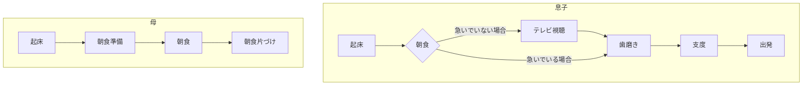

## フローチャートの記述
ダイアグラムの種類にフローチャートを指定する場合、graph XXまたはflowchart XXと記述します。
XXの部分は以下から指定することで、フローの方向が決まります。
```
flowchart TD

subgraph 息子
a1[起床]-->a2{朝食}
a2-->|急いでいない場合|a3[テレビ視聴]-->a4[歯磨き]
a2-->|急いでいる場合|a4
a4-->a5[支度]-->a6[出発]
end

subgraph 母
b1[起床]-->b2[朝食準備]-->b3[朝食]-->b4[朝食片づけ]
end
```

引用先:https://zenn.dev/kento_mm_ninw/articles/8b10afdbef306a