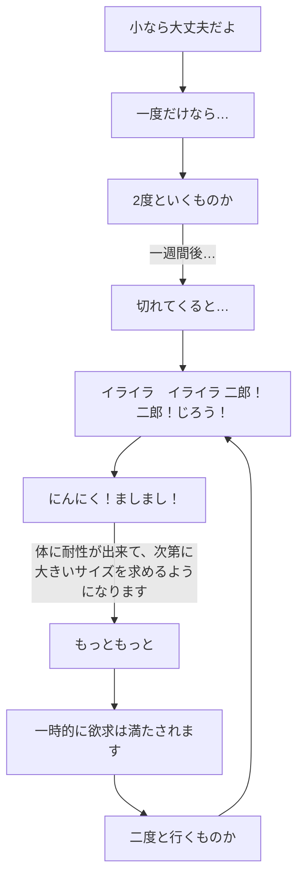

## フローチャートのチュートリアル
二郎ラーメンのフローチャート
```
flowchart TD

start [小なら大丈夫だよ] --> A ["一度だけなら…"] --> B  [2度といくものか]
B -->|"一週間後…"| C ["切れてくると…"]
C --> D ["イライラ　イライラ 二郎！二郎！じろう！"]
D --> E ["にんにく！ましまし！"]
E -->|"体に耐性が出来て、次第に大きいサイズを求めるようになります"| F [もっともっと]
F --> G [一時的に欲求は満たされます]
G --> H [二度と行くものか]
H --> D
```


引用先:https://zenn.dev/microsoft/articles/learning-mermaid