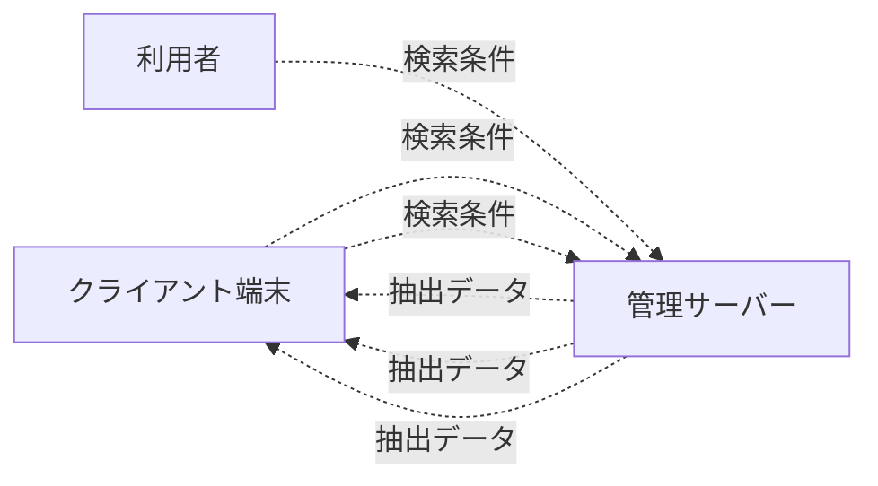

# システム全体図
ネットワーク経由で複数マシンからアクセス

```mermaid 
    graph LR
        クライアント端末-."検索条件".->管理サーバー
        管理サーバー-."抽出データ".->クライアント端末
    
        クライアント端末-."検索条件".->管理サーバー
        管理サーバー-."抽出データ".->クライアント端末

        利用者-."検索条件".->管理サーバー
        管理サーバー-."抽出データ".->クライアント端末
        
```
